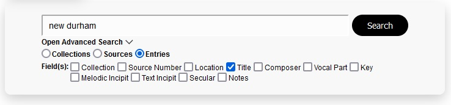
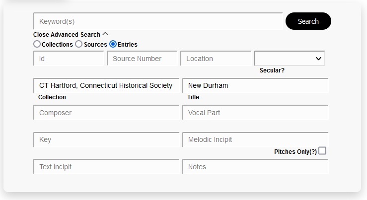
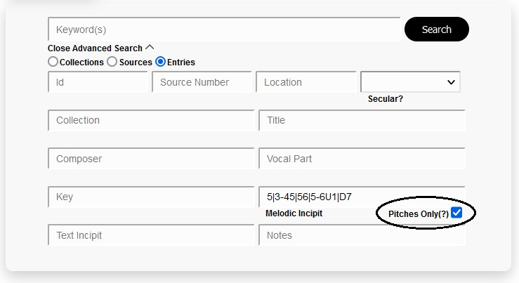
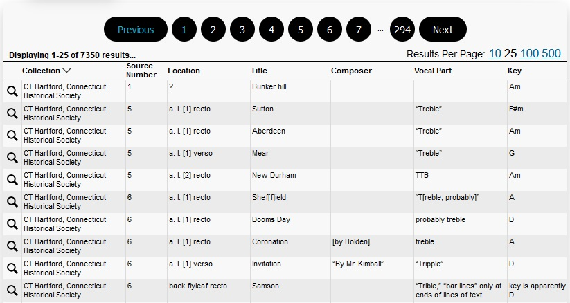
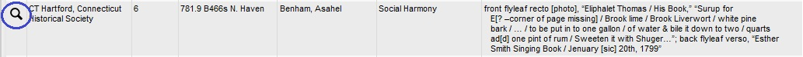
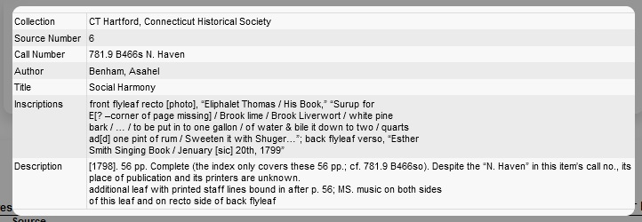
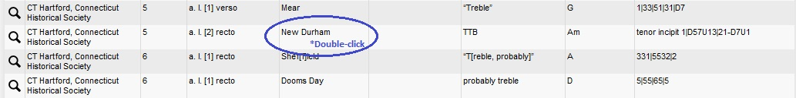
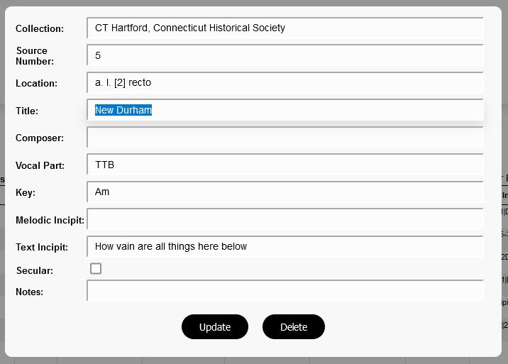
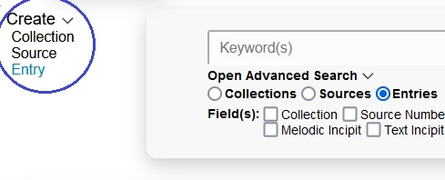
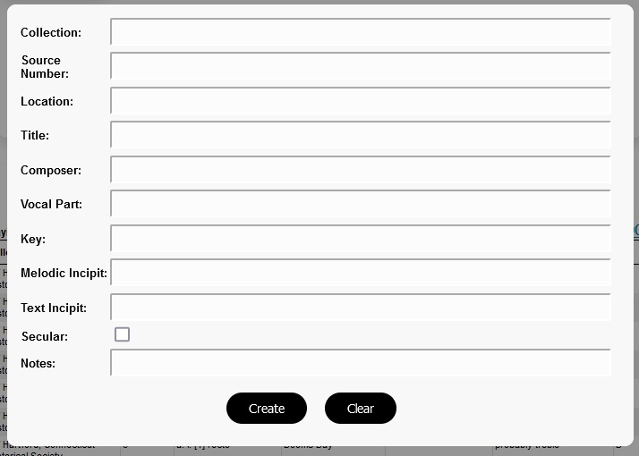

# Music Inventory Web

A full-stack web application for searching, viewing, and editing the Sacred Music Inventory MySQL database.

Built using Spring Boot, vanilla JavaScript, MySQL, and SASS. The front end code can be found in the [src/main/resources/static](https://github.com/2human/music-inventory-web-legacy/tree/master/src/main/resources/static) folder.

This is a legacy version of the project. The front end has been fully re-constructed as a [React application](https://github.com/2human/music-inventory-web-react), which is now the live version of the application.

## Background

This project is an extension of the [Music Inventory Parser application](https://github.com/2human/music-inventory-parser), which was compiled the Sacred Music Inventory database by parsing music inventory Word documents. Visit that repository for the full history of this project.

Around the time Nym Cooke(the author of the music inventory Word documents) and I finished compiling the initial Sacred Music Inventory database, I had decided to pursue a career in web development. With that in mind, creating a web application around the Sacred Music Inventory database was a natural choice for a learning project.

Not knowing how involved the project would ultimately become, I chose to create the project using vanilla JavaScript, as the general impression I'd gotten was that it was beneficial to learn regular JavaScript before jumping into a framework. This project was a bit more than I had bargained for at the time, since I had so little knowledge of the web development landscape, but it turned out to be a great learning experience.

This was originally going to be just a learning project. Even after we initially got it functioning, Nym and I were unsure about what we'd do with it. We were considering donating it to the American Antiquarian Society. About a year after starting this project, where I had learned more about web development, and we were both more invested in the project, we decided that the best course of action would be to release this as part of a web site on our own.

So I first learned how to deploy web applications using AWS, making the initial version of the site accessible online. Later in the year, I learned much more about web design, and fully re-designed the user interface into a fully responsive UI.

One issue I saw with the project was the architecture and general code quality of this program. I had understood very little about the values of maintainability, modularity, archeticture, and clean code when I started this project. As I learned about these principles, I heavily refactored this application alongside the Music Inventory Parser application.

However, the code base was still flawed. What had started out as a vanilla JavaScript learning project was becoming a real web application which would be used for years to come. While I took pride in managing to build such an application with vanilla JavaScript, it was not the type of code I intended to write in a professional environment once I'd acquired a position. It also represented a major 'technical debt' for the future as changes needed to be made to the application.

With that in mind, I made the decision to fully re-write the front end of this application using React with a test-driven approach, which I completed mid-2022. The [React version of this application](https://github.com/2human/music-inventory-web-react) is now live, and will be the primary version we use into the future.

## Overview

The Sacred Music Inventory database contains three tables: collections, sources, and entries.

The primary function of the application is searching the Sacred Music Inventory database. It is capable of performing both basic and advanced searches.

The secondary function is as an editing tool for the author of the source Word documents. This includes a UI and corresponding API's for creating, updating, and deleting database entries.

## Basic Search

Below is an example of the basic search feature in use.

The user types the search term into the keyword field, and each field is checked for the occurrence of the string.

The server achieves this by performing a SQL query of each selected field against the search term, utilizing a Set object in order to avoid duplicates.

In cases where no fields are selected, SQL queries are performed for every field.

## Advanced Search

The user may perform an advanced search by clicking 'Open Advanced Search', which will replace the field checkboxes with a group of text inputs corresponding to each field.

Below is an example of the advanced search feature in use.

The user types their desired text into the desired fields, and the server returns only database entries which contain the given text in their respective fields. The text is not case sensitive. In the example above, entries containing both "CT Hartford, Connecticut Historical Society" in the 'collection' field and "New Durham" in the 'title' field. The keyword search may still be used, and performs similarly to as in a basic search, checking for the given term in every field.

The server achieves this by initially performing a SQL query of the first field containing text. It then filters the result set by checking for the existence the search text in each remaining advanced search field which contains text. In the example above, the server would first query the database for entries which contain the term "CT Hartford, Connecticut Historical Society" in the 'collection' field. It would then filter that result set according to each remaining field, in this case "New Durham" in the 'title' field.

To be clear, after the initial SQL query, the results are filtered on the server with no further SQL queries. Instead, it iterates over the result set, filtering out the results that do not contain the search text, returning a new data object containing the filtered results.

**Pitches Only**

One feature unique to advanced searches is the 'Pitches only' search, which may be performed within the 'melodic incipit' field of the Entries table. Pitches in this context are represented by numbers that correspond to musical pitches.

The text populating the 'melodic incipit field' is an example of what a melodic incipit looks like. When a 'pitches only' search is performed, all non-integer characters are filtered out of the search term, as well as the data, when they are being evaluated against each other. More specifically, the search term in the example, "5|3-45|56|5-6U1|D7", would filtered down to "5345565617". Each melodic incipit would be filtered of all non-integer characters in the same fashion, and then compared against the melodic incipit containing only pitches. This feature makes melodic incipit searches much more viable, as the non-integer characters contained within the music inventories are inconsistent across different musical sources.

## Search Results

When a search is performed, the entire result set is transferred to the user at once rather than only the result page being viewed. The allows the user to instantatenously view the other pages in the result set without making additional server requests, which also reduces the amount of computation required by the server. The drawback is the increased amount of bandwidth that must be used to transfer the resources. As of now, the most results a user can acquire at once is about 7000 entries, which would occur if they performed a search that returned every row in the entry table. This amounts to 2.3 MB worth of data, which appears to be a worthy tradeoff. This may change as the application acquires more users, or as more data is added.

As shown in the example, the user may choose the results per page they would like to use, as well as the page number.

Aditionally, the user may also open modals from the search results section that allow them to either view or edit the result set.

## Viewing Individual Search Results

The user may view a single search result by clicking on the magnifying glass in the first column.

This opens a modal with an expanded view of the search result, as shown below.

## Editing / Deleting Search Results

The user may edit a search result be double-clicking on any table cell.

This opens the editor modal, highlighting the field that was double-clicked, as shown below:

The user can then click 'Update' when they have made their desired changes.

The user may also click 'Delete' in order to delete the selected row.

## Creating Rows

Rows can be created by hovering 'Create', and then clicking the datatype of the row they would like to create.

This opens the modal for creating rows, as shown below:

The user can then fill out the fields, and click 'Create' in order to create a new row.

## Web Design

The web design for this project was performed using SASS with BEM and 7-1 architecture.
